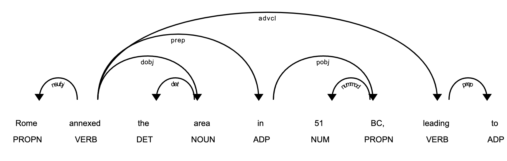
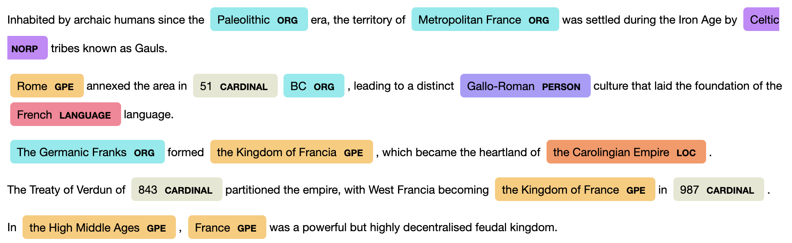
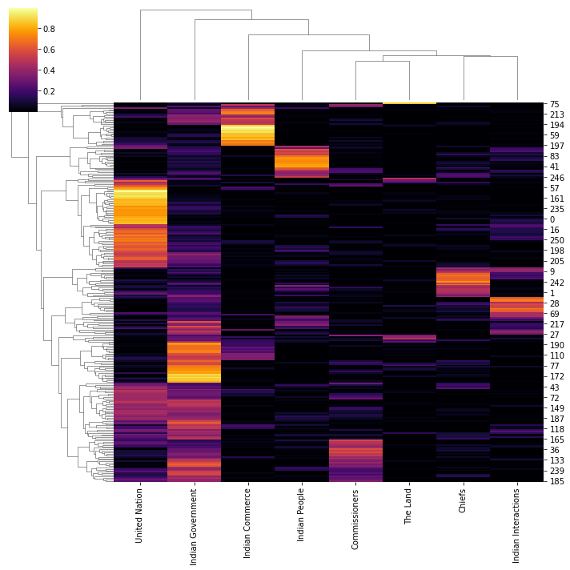
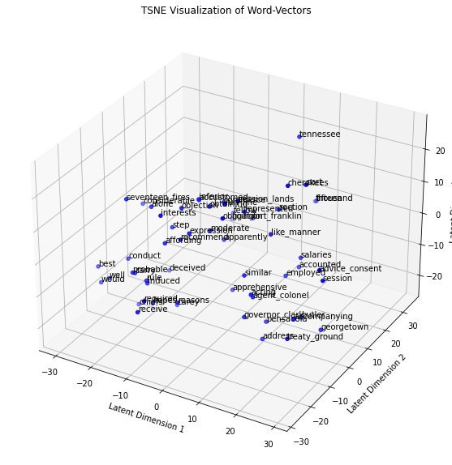

# NLP-Graphical-Knowledge-Mining of Corpora

This is the research report on findings and specific techniques used over the duration of the project:  
[Research Report and Log](https://docs.google.com/document/d/e/2PACX-1vSIw1POZUwxTctdvXyO17dm-Ov9lk67xE5Xh1J1fbXHqhz4v9N4AKYAmsu8BQ8117aMsLtLaUUSMTHw/pub)

Research Paper: 
[NLP Methodologies for Integrated Graph-based Knowledge Extraction of Multilingual Large Scale Text Corpora](https://docs.google.com/document/d/1rMXLpq-jAv0JNntelbfRGY327EllKOwhn4sazzjlIoU/edit?usp=sharing)

## Research Questions and Goals
Calculate similarity score between two documents
By using distance Frèchet Inception Distance from Word2Vec
Score after comparing two document summary generations
Generation of similar text based on trained documents 
Experiment with n-grams
Create social graph between people mentioned in documents

## NLP Research Techniques
Latent Dirichlet Allocation (LDA)
Word occurrence using tf-idf scheme
LSI dimension reduction singular value decomposition of term-by-document matrix X
Alternative: pLSI aspect model
Above methods are flawed fundamentally, hence LDA method

## Research Results

Part of Speech (POS) Tagged Sentence Fragment with Entity Relations

POS-Labeled Document Excerpt

Document Topical Heatmap Distribution Across Sample Corpora

t-SNE Representation of Custom Word2Vec Model Trained on Corpus

